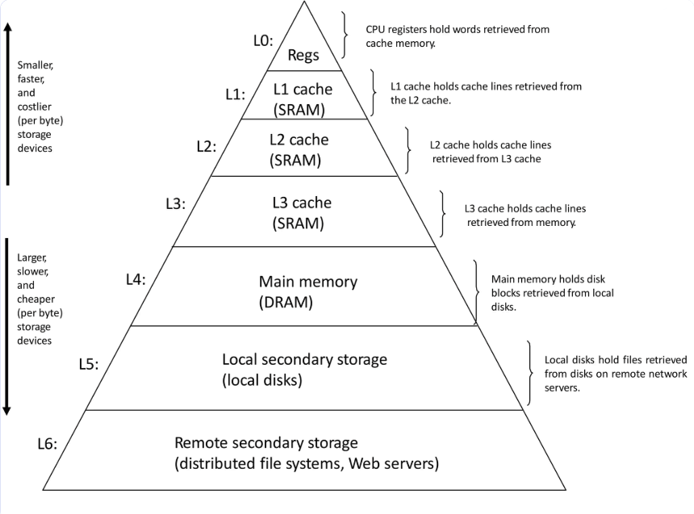

# SpMV Benchmark

This project benchmarks Sparse Matrix-Vector Multiplication (SpMV) on
SuiteSparse matrices. It evaluates how graph/ordering structure affects the
memory behavior and end-to-end performance of the SpMV kernel.

The benchmark core is written in C. Python is used only for reading result CSVs
and generating figures/tables.



## Goals

The benchmark is built around a practical question: when does paying the cost of
matrix reordering improve SpMV enough to matter?

It records:

- SpMV runtime and GFLOP/s across measurement methodologies.
- Reordering cost for RCM, AMD, and ND.
- Structural matrix metrics such as bandwidth, density, and load imbalance.
- Cache and TLB counter behavior through PAPI.
- Cross-platform behavior on x86 and ARM systems.

!!! note "Why this is memory-focused"
    SpMV usually performs little arithmetic per byte moved. Performance is often
    limited by sparse access patterns, cache reuse, TLB behavior, and memory
    bandwidth rather than floating-point throughput.

## Main Workflow

Run commands from the project root:

```bash
scripts/download_matrices.sh
make all
make run-all
make run-all-tlb
make run-all-cache
make plot
```

`make plot` runs the analysis as a module:

```bash
python3 -m scripts.analysis
```

The shortcut script runs the benchmark and plotting pipeline:

```bash
scripts/run_all.sh
```

## Output Map

| Artifact | Location |
| --- | --- |
| Download manifest | `config/matrix_sources.tsv` |
| Matrix files | `matrices/<category>/<matrix>.mtx` |
| x86 CSVs | `results/x86_results/` |
| ARM CSVs | `results/arm_results/` |
| Heatmaps | `figures/heatmaps/` |
| Bar charts | `figures/barcharts/` |
| Faceted cache/TLB plots | `figures/faceted/` |
| Sparsity plots | `figures/sparsity/` |
| LaTeX tables | `figures/tables/` |

## Documentation

Serve these docs locally with:

```bash
mkdocs serve -f docs/mkdocs.yml
```

Build the static docs site with:

```bash
mkdocs build -f docs/mkdocs.yml
```

The documentation uses MkDocs Material. Install the docs dependency with:

```bash
pip install -r docs/requirements.txt
```
