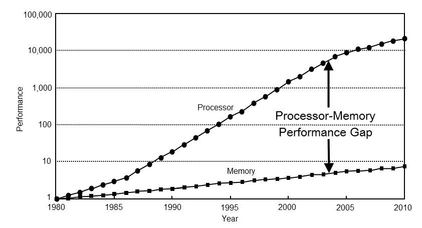

# Methodology

The benchmark measures how reordering changes SpMV behavior. The central
operation is:

```text
y = A * x
```

where `A` is stored as CSR and comes from a SuiteSparse Matrix Market file.

## CSR Execution Model

The parser reads `.mtx` files into COO and converts them to CSR. CSR is a natural
baseline for row-wise SpMV:

```text
for row in rows:
    for idx in row_ptr[row] .. row_ptr[row + 1]:
        y[row] += values[idx] * x[col_idx[idx]]
```

The expensive part is usually not the multiply-add itself. The irregular access
to `x[col_idx[idx]]` can stress cache and TLB behavior, especially for matrices
with wide bandwidth or graph-like sparsity.



## Reordering Methods

The benchmark compares the original matrix ordering against:

| Method | Intent |
| --- | --- |
| RCM | Reduce matrix bandwidth and improve locality for some sparse patterns |
| AMD | Reduce fill-oriented graph structure; useful as a structural ordering baseline |
| ND | Partition graph structure using nested dissection |

The reordered matrix is constructed as:

```text
A' = P A P^T
```

The SpMV input is transformed consistently so correctness is preserved:

```text
y' = A' (P x)
y  = P^T y'
```

## Timing Methodologies

The project records three timing variants:

| Methodology | Purpose |
| --- | --- |
| RAx | Repeated `A * x`; captures steady-state behavior |
| IOs | Swaps input/output vectors between iterations |
| Cold | Attempts to reduce warm-cache bias |

These methodologies help distinguish real reordering benefits from measurement
artifacts caused by cache warmup or reused vector state.

## Structural Metrics

The main benchmark also records matrix-level properties:

- number of rows/columns
- nonzeros
- average and standard deviation of nonzeros per row
- maximum and average bandwidth
- load imbalance estimate
- density

These metrics make it possible to compare performance against matrix structure,
not just against matrix names.

## Counter Measurements

Two additional binaries measure hardware-counter behavior:

| Binary | Purpose |
| --- | --- |
| `bin/spmv-benchmark-cache` | L1/L2/L3 cache miss counters where available |
| `bin/spmv-benchmark-tlb` | DTLB and ITLB miss counters where available |

Counter data is collected separately from the timing pipeline because PAPI event
availability and overhead differ by platform.
