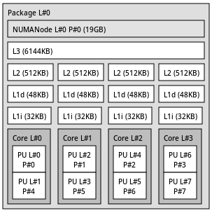
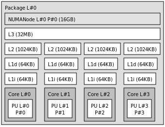

# Platforms

The project compares x86 and ARM behavior to test whether reordering benefits
are architecture-dependent.

## x86 System



| Component | Value |
| --- | --- |
| CPU | Intel Core i5-1035G1 |
| Microarchitecture | Ice Lake |
| Cores / threads | 4 cores / 8 threads |
| L1d | 48 KB per core |
| L2 | 512 KB per core |
| L3 | 6 MB shared |
| RAM | 20 GB |
| Compiler flags | `-O3 -march=native` |

The x86 result directory is:

```text
results/x86_results/
```

## ARM System



| Component | Value |
| --- | --- |
| CPU | ARM Neoverse-N1 |
| Microarchitecture | Neoverse N1 |
| Cores / threads | 4 cores / 4 threads |
| L1d | 64 KB per core |
| L2 | 1 MB per core |
| L3 | 32 MB shared |
| RAM | 16 GB |
| Compiler flags | `-O3 -mcpu=native` |

The ARM result directory is:

```text
results/arm_results/
```

## Why Compare Architectures?

Reordering changes memory access order, not just arithmetic count. Its value can
therefore depend on:

- cache size and associativity
- memory latency and bandwidth
- TLB size and page behavior
- hardware prefetching
- OpenMP scheduling overhead

The benchmark keeps the matrix set and generated CSV schema aligned so Python
analysis can compare the two platforms directly.
