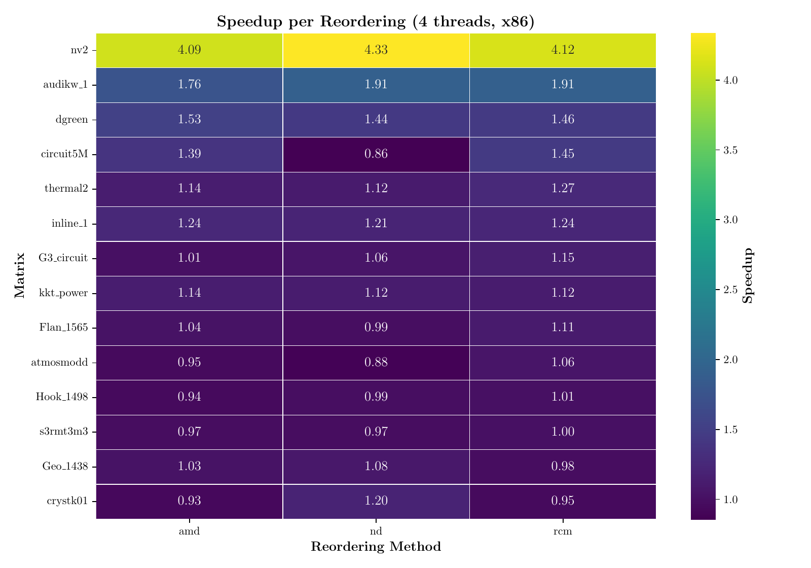
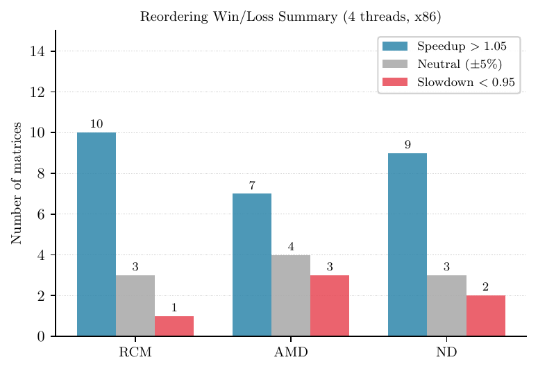
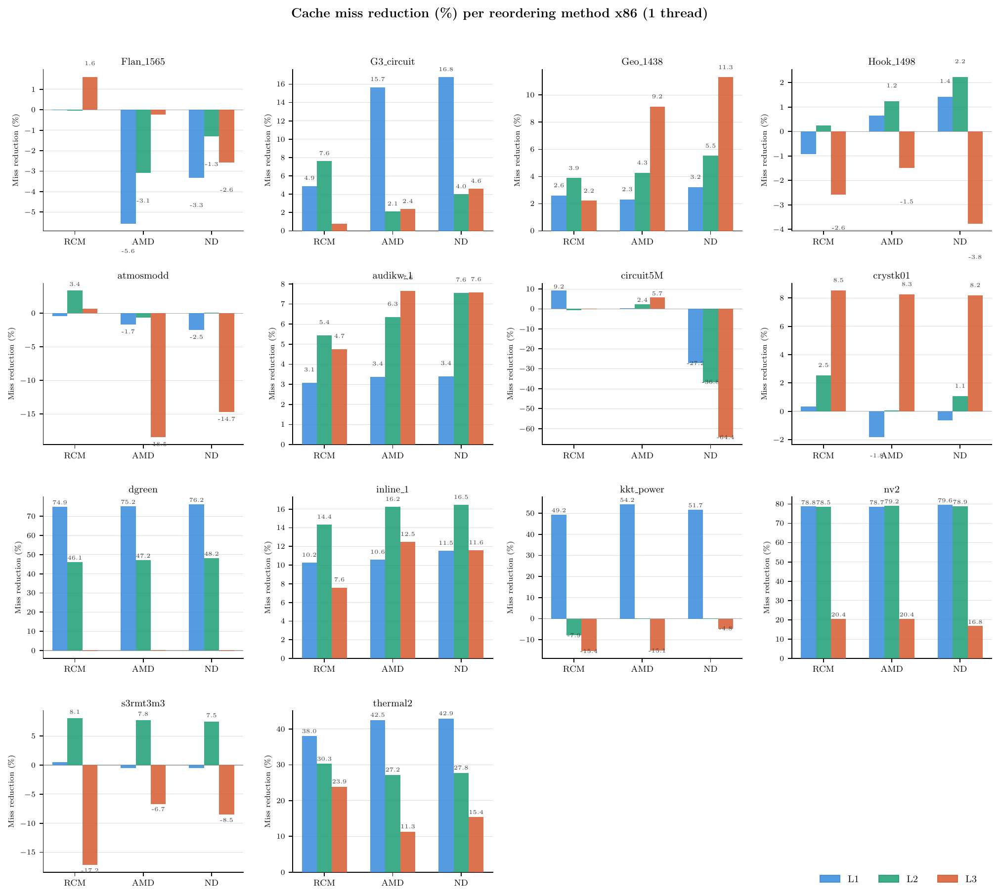
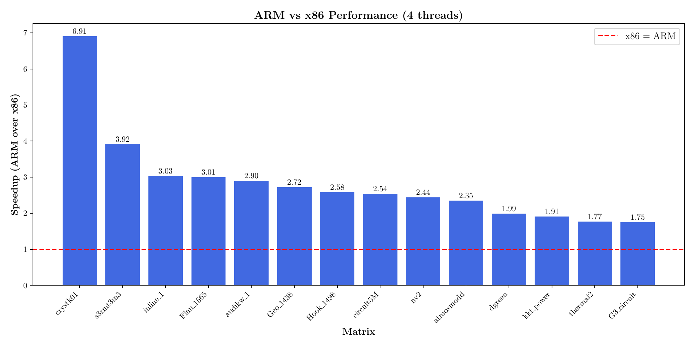

# Result Figures

This page shows representative figures from the thesis output and explains how
to read the generated plot groups.

## Speedup Heatmaps

Generated by:

```text
utils/plotting/heatmaps.py
```

Output directory:

```text
figures/heatmaps/
```



Each cell is:

```text
time(original ordering) / time(reordered matrix)
```

Values above `1.0` indicate a speedup from reordering. Values below `1.0`
indicate slowdown.

## Win/Loss Bar Charts

Generated by:

```text
utils/plotting/barcharts.py
```

Output directory:

```text
figures/barcharts/
```



The win/loss plot groups matrices by whether a reordering gives meaningful
speedup, neutral behavior, or slowdown under the selected threshold.

## Cache/TLB Faceted Plots

Generated by:

```text
utils/plotting/faceted.py
```

Output directory:

```text
figures/faceted/
```



The faceted plots show one panel per matrix. This avoids hiding matrix-specific
effects behind aggregate averages.

## ARM vs x86 Comparison

Generated by:

```text
utils/plotting/barcharts.py
```



This chart compares platform behavior using the generated cold-measurement CSVs.
It depends on both platform result directories containing compatible matrix
names.

## Tables

Tables are generated as LaTeX files in:

```text
figures/tables/
```

The table generator produces:

- scaling tables
- methodology comparison tables
- break-even tables
- matrix characteristics tables

These files are meant to be included directly in the thesis document.
