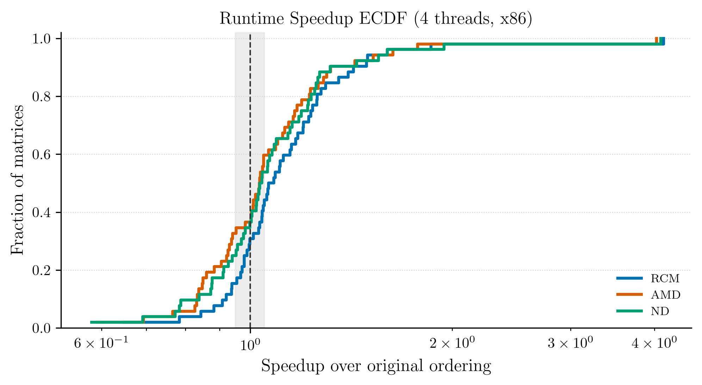

# Result Figures

This page shows representative figures from the thesis output and explains how
to read the generated plot groups.

## Speedup Overview

Generated by:

```text
utils/plotting/overview.py
```

Output directory:

```text
figures/overview/
```



The ECDF plots all matrices without assigning a visible row to every matrix.
The x-axis is:

```text
time(original ordering) / time(reordered matrix)
```

Values above `1.0` indicate a speedup from reordering. Values below `1.0`
indicate slowdown. The y-axis shows the fraction of matrices at or below each
speedup, so curves farther to the right indicate better behavior across the
benchmark set.

## Win/Loss Bar Charts

Generated by:

```text
utils/plotting/barcharts.py
```

Output directory:

```text
figures/barcharts/
```


The win/loss plot groups matrices by whether a reordering gives meaningful
speedup, neutral behavior, or slowdown under the selected threshold.

## Cache/TLB Counter Overviews

Generated by:

```text
utils/plotting/overview.py
```

Output directory:

```text
figures/overview/
```

The cache and TLB overviews use percentile intervals instead of one subplot per
matrix. Each method/counter marker shows the median reduction; the thick and
thin intervals show the interquartile and 10th-90th percentile spread.

Counter distributions are also written to:

```text
figures/distributions/
```

## ARM vs x86 Comparison

Generated by:

```text
utils/plotting/barcharts.py
```


This chart compares platform behavior using the generated cold-measurement CSVs.
It depends on both platform result directories containing compatible matrix
names.

## Tables

Tables are generated as LaTeX files in:

```text
figures/tables/
```

The table generator produces:

- scaling tables
- methodology comparison tables
- break-even tables
- matrix characteristics tables

These files are meant to be included directly in the thesis document.
